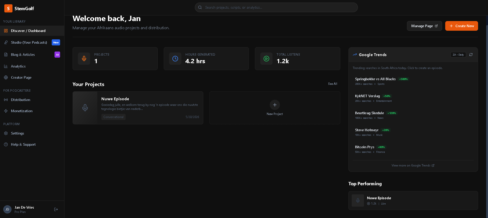
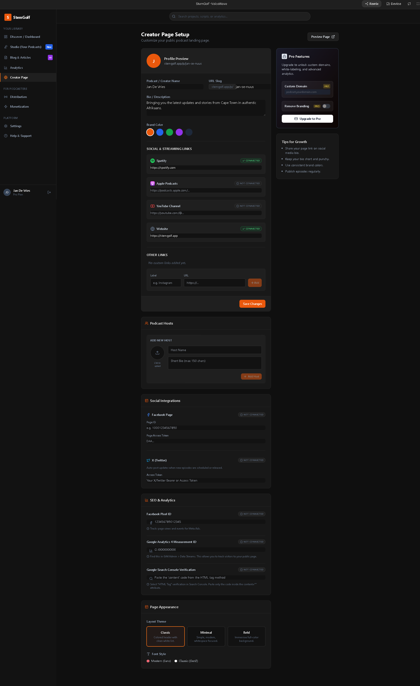
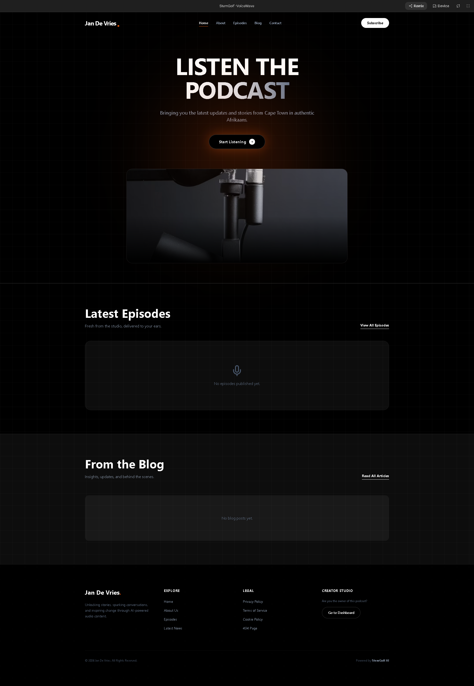
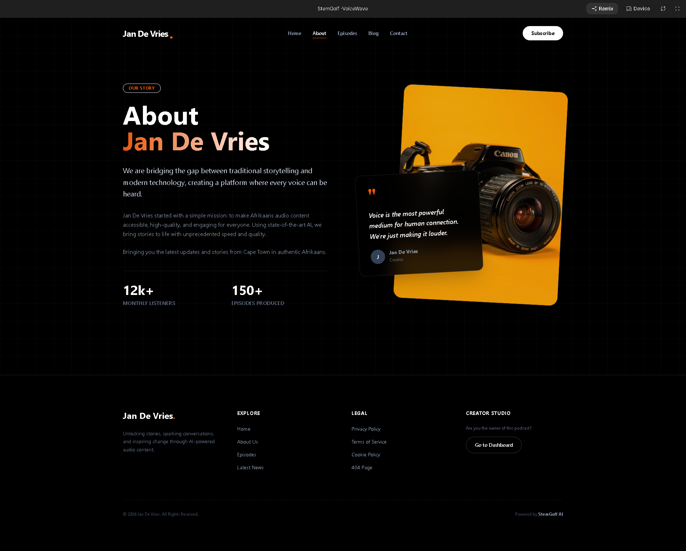
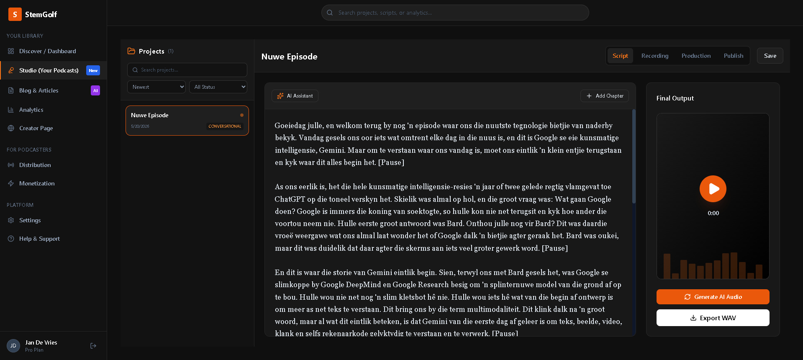
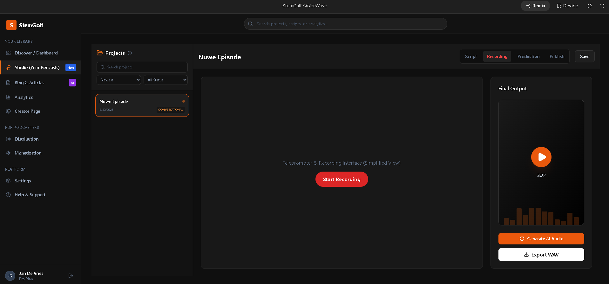
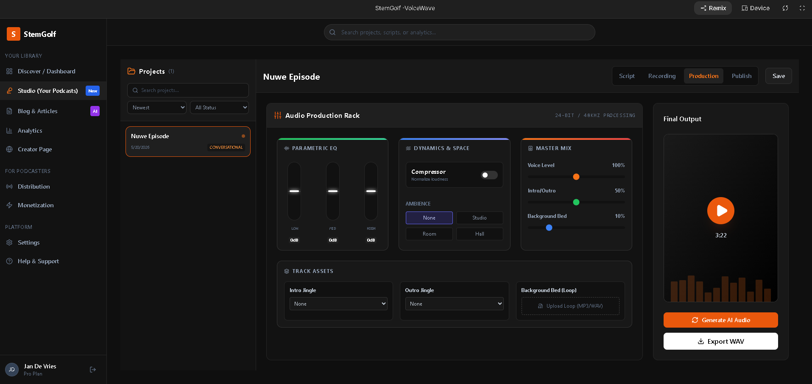
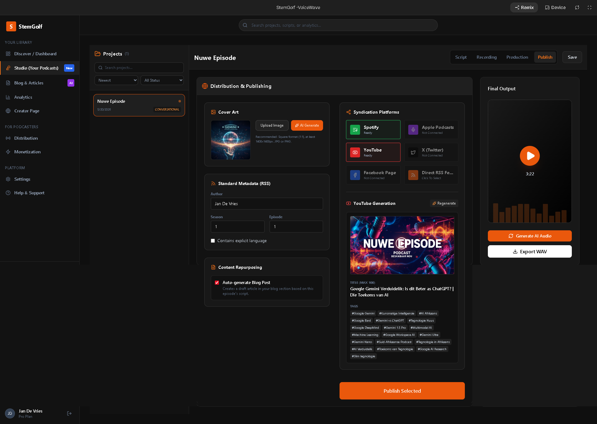
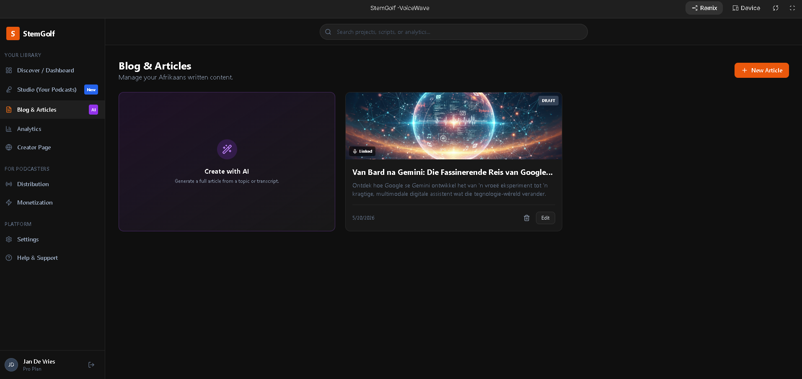
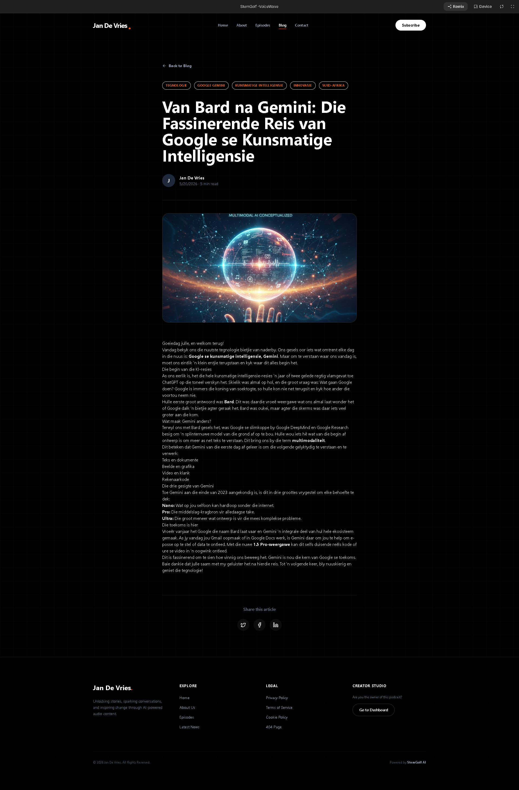

<div align="center">

</div>

# StemGolf-VocalWave

> An AI-powered application for vocal analysis and music stem separation using Google Gemini API


## 📋 About

StemGolf-VocalWave is an innovative web application that combines **vocal wave analysis** with **music stem separation** capabilities. Powered by Google's Gemini API, this app helps musicians, producers, and audio engineers extract, analyze, and manipulate individual instrument stems from audio tracks.

### Key Features

- 🎵 **Audio Stem Separation** - Isolate vocals, drums, bass, and other instruments from mixed audio
- 🎤 **Vocal Analysis** - Advanced voice and vocal pattern recognition using AI
- 🧠 **AI-Powered Insights** - Powered by Google Gemini for intelligent audio understanding
- 🚀 **Real-time Processing** - Fast and efficient audio processing
- 💾 **Easy Export** - Download separated stems in multiple formats
- 🎨 **User-Friendly Interface** - Intuitive design for seamless user experience

### Use Cases

- Music production and beat-making
- Vocal coaching and training
- Podcast and voice content editing
- Educational audio analysis
- DJ mixing and remixing
- Audio restoration

## 🚀 Run Locally

**Prerequisites:**  Node.js (v18 or higher)

1. Clone the repository:
   ```bash
   git clone https://github.com/EGZeelie/StemGolf-VocalWave.git
   cd StemGolf-VocalWave
   ```

2. Install dependencies:
   ```bash
   npm install
   ```

3. Set up environment variables:
   - Create or update the `.env.local` file
   - Add your Gemini API key:
   ```
   GEMINI_API_KEY=your_api_key_here
   ```
   - Get your API key from [Google AI Studio](https://ai.google.dev)

4. Run the app:
   ```bash
   npm run dev
   ```

5. Open your browser and navigate to `http://localhost:3000`

## 📱 Screenshots

### Screenshot 1


### Screenshot 2


### Screenshot 3


### Screenshot 4


### Screenshot 5


### Screenshot 6


### Screenshot 7


### Screenshot 8


### Screenshot 9


### Screenshot 10


## 🛠️ Tech Stack

- **Frontend:** React / Next.js
- **AI Engine:** Google Gemini API
- **Styling:** Tailwind CSS / CSS Modules
- **Backend:** Node.js
- **Deployment:** Google AI Studio

## 📦 Available Scripts

- `npm run dev` - Start development server
- `npm run build` - Build for production
- `npm start` - Start production server
- `npm run lint` - Run linting checks

## 🔑 Environment Variables

Required environment variables in `.env.local`:

```env
GEMINI_API_KEY=your_gemini_api_key
```

## 🤝 Contributing

Contributions are welcome! Please feel free to submit issues or pull requests.

## 📄 License

This project is licensed under the MIT License - see the LICENSE file for details.

## 🔗 Links

- [View on AI Studio](https://ai.studio/apps/380fbb49-06de-4c4c-8968-395e6de88de2)
- [Google Gemini API Documentation](https://ai.google.dev)
- [Google AI Studio](https://ai.google.dev)

## 👤 Author

**EGZeelie**

---

Made with ❤️ using Google Gemini API
